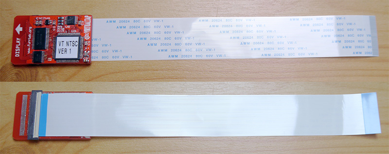

# VirtualTap

## What it is
A small mod board made to be plugged inside a Nintendo Virtualboy unit to make it output standard VGA or NTSC RGB video.

## What this is
All the necessary files to make, assemble, and program the board yourself.
Please respect the LICENSE :3

## How it works
The signals sent to one of the Virtualboy's displays are tapped and level-translated to 3.3V for processing by a CPLD clocked at 40MHz. It interleaves the writes to a parallel SRAM chip (framebuffer) with reads to output the rotated frame one pixel at a time to three 2-bit R-2R DACs according to the selected palette. The voltages and the generated sync signal are fed to a 4-channel THS7373 video amp for final output to whatever socket the user wishes to use.

## Servo emulator

This is only useful if you wish to consolize your VirtualBoy and get rid of the mechanical parts to make it smaller.

The servo emulator makes the VirtualBoy think the eye displays are still there and working properly.

You only need to program a cheap microcontroler with this code and wire it up to your VirtualBoy's main board.

Porting the code to the Arduino Nano or other small AVR boards should be pretty straightforward.
