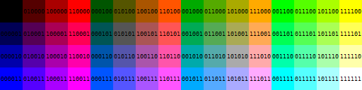

# How to program the CPLD

Download a version of Quartus which supports the Max V series, and buy (or build) a fake $30 Altera USB Blaster cable.
Connect the 6 JTAG pins on the board to the programmer, provide power to the board and write one of the `.pof` files.

# Creating custom palettes

The 8 default palettes can be modified to suit your needs by editing the following section of Verilog code:

```
// Palette LUT
always @(*) begin
				     // 3     2     1     0
	case(PALETTE)		     // RRGGBBRRGGBBRRGGBBRRGGBB
		3'd0: PAL_COLORS <= 24'b110000100000010000000000;	// Red gradient
		3'd1: PAL_COLORS <= 24'b111100101000010100000000;	// Yellow gradient
		3'd2: PAL_COLORS <= 24'b001100001000000100000000;	// Green gradient
		3'd3: PAL_COLORS <= 24'b001111001010000101000000;	// Cyan gradient
		3'd4: PAL_COLORS <= 24'b000011000010000001000000;	// Blue gradient
		3'd5: PAL_COLORS <= 24'b110011100010010001000000;	// Magenta gradient
		3'd6: PAL_COLORS <= 24'b111111101010010101000000;	// White gradient
		3'd7: PAL_COLORS <= 24'b000000010101101010111111;	// White inverted gradient
	endcase
end
```

Each line in the `case` block defines the RGB values for each of the 4 colors of a given palette, top to bottom from 0 to 7.

The 24 bits represent the 2-bit values for each R, G and B component for each color index, left to right from brightest to darkest.

All combinations of colors are possible but the output is limited by the hardware to 2-bit per component, so the available colors can only be taken from the following table (which is coincidentally the Sega Master System palette):


